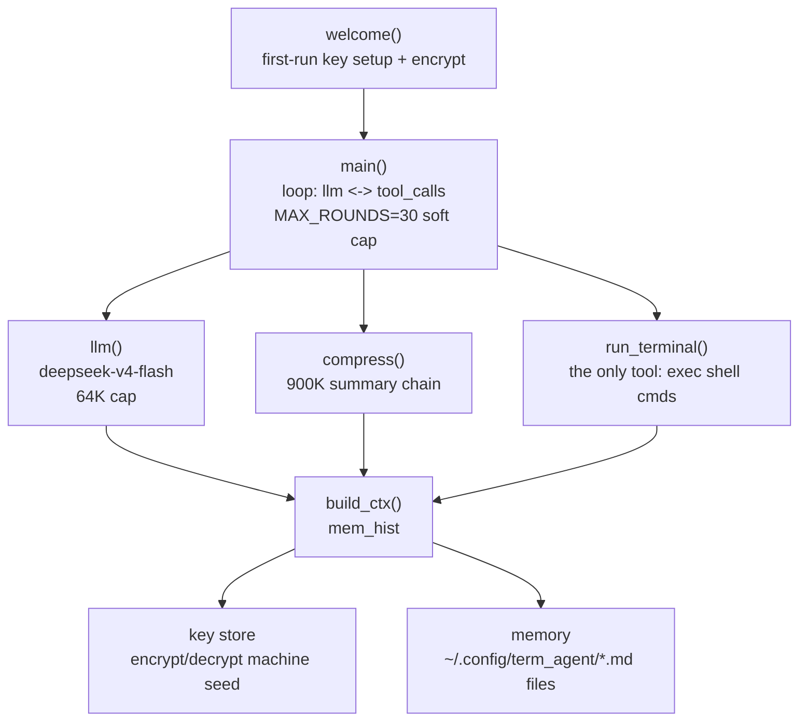

# AGENT IN TERMINAL


超轻量终端内 AI Agent
## QUICK START

全球 CDN 一键安装（国内直连，无需代理）：

```bash
curl -fsSL https://cdn.jsdelivr.net/gh/Xiyinnnnnn/Agent-in-Terminal@main/install.sh | bash
```

GitHub 直连（海外用户）：

```bash
curl -fsSL https://raw.githubusercontent.com/Xiyinnnnnn/Agent-in-Terminal/main/install.sh | bash
```

> 脚本内部自动双源回退：优先走 jsDelivr CDN，失败自动切 GitHub raw，无需手动选择。

首次运行输入 DeepSeek API Key：

- 输入不可见（getpass）
- 机器绑定加密落盘（`~/.config/term_agent/key.bin`）
- 唯一落盘项，不出现明文

## USAGE

```bash
# 命令行
python3 ~/.local/bin/term_agent/term_agent.py

# 或应用菜单搜索「终端智能体」双击
```

## ARCHITECTURE



| 层 | 组件 | 职责 |
|---|---|---|
| ENTRY | `welcome()` | 首次运行引导，Key 加密入库 |
| CORE | `main()` | 主循环：LLM 对话、工具调用解析、结果回填 |
| LLM | `llm()` | DeepSeek 接口，流式 SSE，`with_tools` 切换压缩/推理模式 |
| MEM | `compress()` / `build_context()` | 900K 阈值压缩，摘要链跨会话延续 |
| TOOL | `run_terminal()` | 唯一工具：全部能力收敛到 shell |
| SEC | `encrypt/decrypt_key()` | 机器指纹种子 + 加密，Key 不落明文 |

## CACHE HIT RATE 缓存命中率

按 **DeepSeek-V4-flash 金额口径**实测：缓存命中率 **94.39% 起步**。

> 金额口径：按实际计费金额加权统计（缓存命中输入 token 单价远低于未命中），而非简单 token 数占比。
> 实测基准 94.39% 起步——会话越长、上下文复用越多，命中率与成本优势越明显。

## NOTES

- 新终端 = 新对话
- 想改参数？直接对它说「修改你的程序参数」
- 压缩阈值 / 模型 / 上限写死在程序里，让它自己改

## UPDATE 如何更新

安装脚本是**幂等**的：重复执行安装命令即可覆盖更新程序文件，不会动你的配置和记忆：

```bash
# 方式一：重新执行安装命令（推荐，覆盖 install.sh / term_agent.py / .desktop 三件套）
curl -fsSL https://cdn.jsdelivr.net/gh/Xiyinnnnnn/Agent-in-Terminal@main/install.sh | bash
```

```bash
# 方式二：只更新主程序（脚本装好后的日常更新用这个最快）
curl -fsSL https://cdn.jsdelivr.net/gh/Xiyinnnnnn/Agent-in-Terminal@main/term_agent.py -o ~/.local/bin/term_agent/term_agent.py
```

```bash
# 方式三：直接对 agent 说「更新你自己」（它自带 shell 工具，会自己拉取）
```

> 安全：重跑安装命令不会覆盖 `~/.config/term_agent/`（API Key、记忆），放心更新。
## LICENSE

MIT
