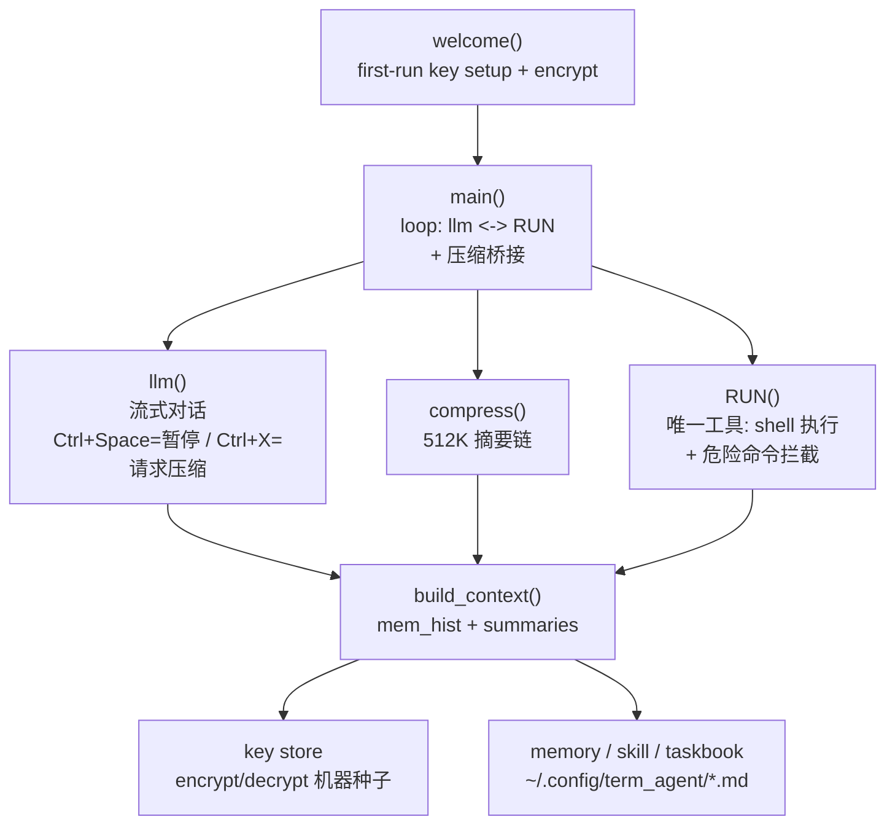
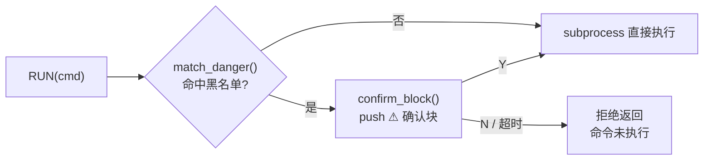

# AGENT IN TERMINAL


超轻量终端内 AI Agent：零依赖单文件，DeepSeek 对话 + Shell 工具执行。
## QUICK START

全球 CDN 一键安装（国内直连，无需代理）：

```bash
curl -fsSL https://cdn.jsdelivr.net/gh/Xiyinnnnnn/Agent-in-Terminal@main/install.sh | bash
```

GitHub 直连（海外用户）：

```bash
curl -fsSL https://raw.githubusercontent.com/Xiyinnnnnn/Agent-in-Terminal/main/install.sh | bash
```

> 脚本内部自动双源回退：优先走 jsDelivr CDN，失败自动切 GitHub raw，无需手动选择。

首次运行输入 DeepSeek API Key：

- 输入不可见（getpass）
- 机器绑定加密落盘（`~/.config/term_agent/key.bin`）
- 唯一落盘项，不出现明文

## USAGE

```bash
# 命令行
python3 ~/.local/bin/term_agent/term_agent.py

# 或应用菜单搜索「终端智能体」双击
```

API 端点与模型写在 `term_agent.py` 顶部常量中（`API_URL` / `MODEL` / `MAX_TOK` / `MAX_OUT`），可自行修改。

## KEY BINDINGS 快捷键

| 按键 | 行为 |
|---|---|
| `Ctrl+Space` | 立即暂停当前执行（不退出，回到提示符） |
| `Ctrl+X` | 请求压缩当前上下文（不打断执行；当前步骤自然结束后进入压缩流程） |

> 启动横幅：`新终端=新对话 | Ctrl+Space=暂停 | Ctrl+X=压缩`
> `Ctrl+X` 只设置请求标记，多次按下合并为一次压缩，不立即执行、不中断 LLM / Shell。

## ARCHITECTURE



| 层 | 组件 | 职责 |
|---|---|---|
| ENTRY | `welcome()` | 首次运行引导，Key 加密入库 |
| CORE | `main()` | 主循环：LLM 对话、工具调用解析、结果回填、压缩请求桥接 |
| LLM | `llm()` | 流式 SSE；`Ctrl+Space` 暂停 / `Ctrl+X` 设压缩请求标记 |
| MEM | `compress()` / `build_context()` | 512K(`MAX_TOK`) 阈值压缩，摘要链跨会话延续 |
| TOOL | `RUN()` | 唯一工具：Shell 执行 + 危险命令安全拦截 |
| SEC | `encrypt/decrypt_key()` | 机器指纹种子加密，Key 不落明文 |

## SECURITY 安全模型

危险命令拦截：**黑名单匹配 → push 确认块 → Y/N 授权**，拦截点在唯一执行入口 `RUN()` 内、`subprocess` 调用之前。



### 黑名单

| 类别 | 条目 |
|---|---|
| 不可逆删除 | `rm` `sudo rm` |
| 磁盘直写/分区/格式化 | `dd` `mkfs` `format` `wipe` `wipefs` `shred` `blkdiscard` `fdisk` `parted` `pvcreate` `vgremove` `lvremove` `> /dev/sd` `> /dev/nvme` `> /dev/vd` `> /dev/mmcblk` |
| 提权+破坏 | `sudo dd` `sudo mkfs` |
| 权限全开 | `chmod -R 777` |
| fork bomb | `:(){` `:(){:|:&};:` |

### 用户授权

- 命中黑名单 → 终端 push 确认块（⚠ + 命中项 + 命令全文）
- 输入 `Y` 执行 / `N` 拒绝 / 超时自动拒绝（`AUTH_TIMEOUT = 30`，设 `0` = 永不超时）

### 自定义

```python
AUTH_TIMEOUT = 30          # 确认超时秒数；0 = 永不超时
DANGER_BL = [...]          # 黑名单项：单项=命令名，多项=组合命令
```

## NOTES

- 新终端 = 新对话（每个终端会话独立上下文）
- `Ctrl+Space` = 暂停；`Ctrl+X` = 请求压缩
- 想改参数？直接对它说「修改你的程序参数」
- 压缩阈值 / 模型 / 上限写死在程序里，让它自己改

## UPDATE 如何更新

安装脚本是**幂等**的：重复执行安装命令即可覆盖更新程序文件，不会动你的配置和记忆：

```bash
# 方式一：重新执行安装命令（推荐，覆盖 install.sh / term_agent.py / .desktop 三件套）
curl -fsSL https://cdn.jsdelivr.net/gh/Xiyinnnnnn/Agent-in-Terminal@main/install.sh | bash
```

```bash
# 方式二：只更新主程序（脚本装好后的日常更新用这个最快）
curl -fsSL https://cdn.jsdelivr.net/gh/Xiyinnnnnn/Agent-in-Terminal@main/term_agent.py -o ~/.local/bin/term_agent/term_agent.py
```

```bash
# 方式三：直接对 agent 说「更新你自己」（它自带 shell 工具，会自己拉取）
```

> 安全：重跑安装命令不会覆盖 `~/.config/term_agent/`（API Key、记忆），放心更新。
## LICENSE

MIT

## Channel Manager（微信/QQ 遥控）

`channel/` 为现有 Agent 增加一层极轻量 Channel Manager：让本 Agent 能被 **微信私聊 / QQ私聊 / QQ群@** 遥控。

- 不改 `term_agent.py` 本体；每条独立消息按需新建一个 Agent 进程（并发不串会话）。
- Agent 如何向聊天发消息/文件：用 Shell 调 `channel-reply "文本"` / `channel-send-file "/绝对路径"`。
- 启动：`python3 channel/manager.py --serve`（默认 local 适配器，测试用 `--test "消息" [附件路径...]`）。
- 真实微信/QQ：在 `channel/config.json` 的 `wechat`/`qq` 配好 iLink / OneBot(NapCat/Lagrange) 端点后，把 `adapters` 改为 `["qq"]` 或 `["wechat"]`。
- 详见 `channel/config.example.json` 与各 adapter 文件头注释。

## Agent Channel 控制中心（桌面傻瓜入口）

`control/control.py` 在 Channel Manager 之上加一个**轻量控制层**（非新服务、非框架），只做：启动/停止/状态、微信QQ登录状态查看、多模态开关、看日志。

- 一键安装桌面入口（应用菜单出现 **Agent Channel**，Terminal 弹出管理界面）：
  ```bash
  cd ~/.local/bin/term_agent && ./install_desktop.sh
  ```
  > 脚本按自身位置定位项目，移动目录后重跑一次即可。
- 控制中心 `Exec` 指向 `control/control.py`（不是 manager.py），以后加功能无需改桌面入口。
- 运行状态：PID/日志存 `/tmp/agent-channel/`（不入库）；残留 PID 自动识别清理；已运行则拒绝重复启动。
- 停止优先 SIGTERM 正常退出，超时才 terminate，最后才 kill。
- 多模态开关持久化到 **现有** `channel/config.json`（唯一配置，不新建），只影响新任务，不打断进行中 Agent。
- 微信/QQ 登录态由各自 Adapter 负责（iLink / OneBot），控制中心只显示状态与接入指引，不保存任何 token。
- 命令行子命令（脚本/快捷用）：`control/control.py --status | --start | --stop`
